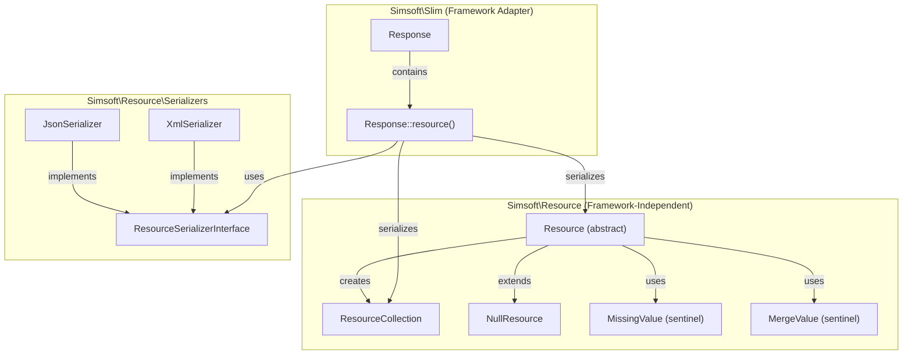
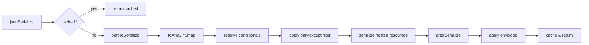

# Design Document: API Resource

## Overview

The API Resource feature introduces a framework-independent data transformation
layer that converts raw PHP data (objects, arrays) into structured JSON API
responses. The core classes (`Resource`, `ResourceCollection`, `NullResource`)
reside in the `Simsoft\Resource` namespace with zero external dependencies,
while a thin adapter in `Simsoft\Slim` bridges the resource layer to the
existing `response()` helper and PSR-7 pipeline.

The design follows a builder pattern with fluent method chaining, sentinel-based
conditional field resolution, recursive nested resource serialization, and a
lifecycle hook system (`beforeSerialize` / `afterSerialize`). Memoization
ensures repeated serialization of the same instance avoids redundant
computation.

## Architecture



### Layer Separation

| Layer             | Namespace          | Dependencies                             |
|-------------------|--------------------|------------------------------------------|
| Core Resource     | `Simsoft\Resource` | PHP built-ins only (`JsonSerializable`)  |
| Framework Adapter | `Simsoft\Slim`     | PSR-7 `ResponseInterface`, Core Resource |

### Serialization Pipeline



## Components and Interfaces

### Core Classes (`Simsoft\Resource` namespace)

#### `Resource` (abstract class)

```php
<?php

declare(strict_types=1);

namespace Simsoft\Resource;

abstract class Resource implements \JsonSerializable
{
    // --- Class-level properties (overridable by subclasses) ---
    protected bool $wrap = true;
    protected string $wrapKey = 'data';
    protected ?string $type = null;

    /** @var array<string, string> */
    protected array $map = [];

    // --- Instance state ---
    /** @var array<string, mixed> */
    protected array $context = [];

    /** @var array<string, mixed>|null */
    private ?array $cachedResult = null;

    /** @var string[]|null */
    private ?array $onlyFields = null;

    /** @var string[]|null */
    private ?array $exceptFields = null;

    /** @var array<string, mixed> */
    private array $meta = [];

    /** @var array<string, string> */
    private array $links = [];

    /** @var array<string, string|string[]> */
    private array $headers = [];

    public function __construct(
        public readonly object|array $resource
    ) {}

    // --- Abstract / overridable ---
    abstract public function toArray(): array;
    protected function beforeSerialize(): void {}
    protected function afterSerialize(array $data): array { return $data; }

    // --- Factory ---
    public static function make(object|array|null $data): static { /* ... */ }
    public static function collection(iterable $items): ResourceCollection { /* ... */ }

    // --- Fluent builders ---
    public function withContext(array $context): static { /* ... */ }
    public function withMeta(array $meta): static { /* ... */ }
    public function withLinks(array $links): static { /* ... */ }
    public function withHeaders(array $headers): static { /* ... */ }
    public function only(string|array ...$fields): static { /* ... */ }
    public function except(string|array ...$fields): static { /* ... */ }

    // --- Conditional helpers ---
    protected function when(bool $condition, mixed $value): mixed { /* ... */ }
    protected function whenNotNull(mixed $value): mixed { /* ... */ }
    protected function mergeWhen(bool $condition, array $fields): MergeValue { /* ... */ }

    // --- Serialization ---
    public function jsonSerialize(): mixed { /* ... */ }
}
```

#### `ResourceCollection`

```php
<?php

declare(strict_types=1);

namespace Simsoft\Resource;

class ResourceCollection implements \JsonSerializable
{
    protected string $wrapKey = 'data';
    protected ?string $type = null;

    /** @var array<string, mixed> */
    protected array $context = [];

    /** @var array<string, mixed> */
    private array $meta = [];

    /** @var array<string, string> */
    private array $links = [];

    /** @var array<string, string|string[]> */
    private array $headers = [];

    /** @var string[]|null */
    private ?array $onlyFields = null;

    /** @var string[]|null */
    private ?array $exceptFields = null;

    /** @var array{total: int, per_page: int, current_page: int, last_page: int}|null */
    private ?array $pagination = null;

    /** @param class-string<Resource> $resourceClass */
    public function __construct(
        private readonly iterable $items,
        private readonly string $resourceClass
    ) { /* validate $resourceClass */ }

    public function paginate(int $total, int $perPage, int $currentPage, int $lastPage): static { /* ... */ }
    public function withContext(array $context): static { /* ... */ }
    public function withMeta(array $meta): static { /* ... */ }
    public function withLinks(array $links): static { /* ... */ }
    public function withHeaders(array $headers): static { /* ... */ }
    public function only(string|array ...$fields): static { /* ... */ }
    public function except(string|array ...$fields): static { /* ... */ }

    public function toArray(): array { /* ... */ }
    public function jsonSerialize(): mixed { /* ... */ }
}
```

#### `NullResource`

```php
<?php

declare(strict_types=1);

namespace Simsoft\Resource;

class NullResource extends Resource
{
    public function __construct()
    {
        // No parent call — resource property not applicable
    }

    public function toArray(): ?array
    {
        return null;
    }
}
```

#### Sentinel Classes

```php
<?php

declare(strict_types=1);

namespace Simsoft\Resource;

/** Sentinel indicating a field should be excluded from output. */
final class MissingValue {}

/** Sentinel carrying fields to merge into the parent array. */
final class MergeValue
{
    public function __construct(
        public readonly array $fields
    ) {}
}
```

### Serializers (`Simsoft\Resource\Serializers` namespace)

#### `ResourceSerializerInterface`

```php
<?php

declare(strict_types=1);

namespace Simsoft\Resource\Serializers;

use Simsoft\Resource\Resource;
use Simsoft\Resource\ResourceCollection;

/**
 * Interface for serializing resources into text-based structured data formats.
 */
interface ResourceSerializerInterface
{
    /**
     * Serialize a Resource or ResourceCollection into a string.
     *
     * @param Resource|ResourceCollection $resource
     * @return string
     * @throws \Simsoft\Resource\Exceptions\SerializationException
     */
    public function serialize(Resource|ResourceCollection $resource): string;

    /**
     * Return the MIME content type for this serializer.
     *
     * @return string
     */
    public function contentType(): string;
}
```

#### `JsonSerializer`

```php
<?php

declare(strict_types=1);

namespace Simsoft\Resource\Serializers;

use Simsoft\Resource\Exceptions\SerializationException;
use Simsoft\Resource\Resource;
use Simsoft\Resource\ResourceCollection;

/**
 * Default JSON serializer for resources.
 */
class JsonSerializer implements ResourceSerializerInterface
{
    public function serialize(Resource|ResourceCollection $resource): string
    {
        $result = json_encode(
            $resource->toSerializedArray(),
            JSON_PRETTY_PRINT | JSON_UNESCAPED_SLASHES
        );

        if ($result === false) {
            throw new SerializationException('Failed to serialize resource to JSON');
        }

        return $result;
    }

    public function contentType(): string
    {
        return 'application/json';
    }
}
```

#### `XmlSerializer`

```php
<?php

declare(strict_types=1);

namespace Simsoft\Resource\Serializers;

use Simsoft\Resource\Exceptions\SerializationException;
use Simsoft\Resource\Resource;
use Simsoft\Resource\ResourceCollection;

/**
 * XML serializer for resources.
 */
class XmlSerializer implements ResourceSerializerInterface
{
    public function serialize(Resource|ResourceCollection $resource): string
    {
        // Converts toSerializedArray() output into well-formed XML 1.0
        // with UTF-8 encoding and <response> root element
    }

    public function contentType(): string
    {
        return 'application/xml';
    }
}
```

### Framework Adapter (`Simsoft\Slim` namespace)

The existing `Response` class gains a `resource()` method:

```php
// In Simsoft\Slim\Response

use Simsoft\Resource\Resource;
use Simsoft\Resource\ResourceCollection;
use Simsoft\Resource\Exceptions\InvalidStatusCodeException;
use Simsoft\Resource\Exceptions\SerializationException;
use Simsoft\Resource\Serializers\ResourceSerializerInterface;
use Simsoft\Resource\Serializers\JsonSerializer;

public function resource(
    Resource|ResourceCollection $resource,
    int $code = 200,
    ?ResourceSerializerInterface $serializer = null
): static {
    if ($code < 100 || $code > 599) {
        throw new InvalidStatusCodeException('Invalid HTTP status code: ' . $code);
    }

    $serializer ??= new JsonSerializer();
    $body = $serializer->serialize($resource);
    $contentType = $serializer->contentType();

    // Apply resource-level headers
    $headers = $resource->getHeaders();
    foreach ($headers as $name => $value) {
        $this->header($name, $value);
    }

    static::$response->getBody()->write($body);
    static::$response = static::$response
        ->withHeader('Content-Type', $contentType)
        ->withStatus($code);

    return $this;
}
```

### File Structure

```
src/
├── Resource/                          # Simsoft\Resource namespace
│   ├── Resource.php                   # Abstract base resource
│   ├── ResourceCollection.php         # Collection transformer
│   ├── NullResource.php               # Null object pattern
│   ├── MissingValue.php               # Sentinel for excluded fields
│   ├── MergeValue.php                 # Sentinel for merged fields
│   ├── Exceptions/                    # Custom exceptions
│   │   ├── InvalidResourceException.php
│   │   ├── InvalidHeaderException.php
│   │   ├── InvalidConfigurationException.php
│   │   ├── SerializationException.php
│   │   └── InvalidStatusCodeException.php
│   └── Serializers/                   # Format adapters
│       ├── ResourceSerializerInterface.php
│       ├── JsonSerializer.php
│       └── XmlSerializer.php
├── Response.php                       # Extended with resource() method
└── ...existing files...
```

The `composer.json` autoload section adds:

```json
{
    "autoload": {
        "psr-4": {
            "Simsoft\\Slim\\": "src",
            "Simsoft\\Resource\\": "src/Resource"
        }
    }
}
```

## Data Models

### Resource Envelope Structure

When wrapping is enabled (default):

```json
{
    "type": "user",
    "data": { "id": 1, "name": "John" },
    "meta": { "timestamp": "2024-01-01T00:00:00Z" },
    "links": { "self": "/users/1" }
}
```

- `type` — present only when `$type` is non-null, non-empty
- `data` (or custom `$wrapKey`) — always present, contains `toArray()` output
- `meta` — present only when metadata or pagination is provided
- `links` — present only when links are provided

When wrapping is disabled (`$wrap = false`):

```json
{
    "id": 1,
    "name": "John",
    "_links": { "self": "/users/1" }
}
```

- `toArray()` output is the top-level structure
- Metadata merges into top-level
- Links placed under `_links` key

### Collection Envelope Structure

```json
{
    "type": "users",
    "data": [
        { "id": 1, "name": "John" },
        { "id": 2, "name": "Jane" }
    ],
    "meta": {
        "total": 50,
        "per_page": 10,
        "current_page": 1,
        "last_page": 5
    },
    "links": {
        "self": "/users?page=1",
        "next": "/users?page=2",
        "last": "/users?page=5"
    }
}
```

### Conditional Field Resolution

| Helper                    | Condition       | Result                                          |
|---------------------------|-----------------|-------------------------------------------------|
| `when(true, $val)`        | condition true  | Include `$val` (evaluate closure if applicable) |
| `when(false, $val)`       | condition false | `MissingValue` sentinel → key removed           |
| `whenNotNull($val)`       | `$val !== null` | Include `$val`                                  |
| `whenNotNull(null)`       | `$val === null` | `MissingValue` sentinel → key removed           |
| `mergeWhen(true, [...])`  | condition true  | `MergeValue` → fields merged into parent        |
| `mergeWhen(false, [...])` | condition false | `MissingValue` sentinel → nothing merged        |

### Mapping Resolution (`$map` property)

```php
protected array $map = [
    'name'  => 'full_name',        // direct property/key
    'city'  => 'address.city',     // dot-notation nested access
    'email' => 'contact.email',    // mixed object/array traversal
];
```

Resolution algorithm per segment:

1. If current value is an object → access as property (`$obj->segment`)
2. If current value is an array → access as key (`$arr['segment']`)
3. If segment doesn't exist or intermediate is null → return `null`

### Caching Behavior

| Action                                | Effect on Cache                  |
|---------------------------------------|----------------------------------|
| First `jsonSerialize()`               | Computes and stores result       |
| Subsequent `jsonSerialize()`          | Returns stored result            |
| `withContext()` called                | Invalidates cache                |
| `ResourceCollection::jsonSerialize()` | Never cached (always recomputes) |

## Correctness Properties

*A property is a characteristic or behavior that should hold true across all
valid executions of a system — essentially, a formal statement about what the
system should do. Properties serve as the bridge between human-readable
specifications and machine-verifiable correctness guarantees.*

### Property 1: Construction preserves data

*For any* valid data item (object or array), constructing a Resource via
`make()` or direct instantiation SHALL store the exact same reference in the
`resource` property, and `make()` SHALL return an instance of the called
subclass.

**Validates: Requirements 1.1, 1.4**

### Property 2: Envelope wrapping round-trip

*For any* associative array returned by `toArray()`, when wrapping is enabled
the `jsonSerialize()` output SHALL contain that array under the configured
`$wrapKey`, and when wrapping is disabled the `jsonSerialize()` output SHALL be
the `toArray()` result directly (without any envelope key).

**Validates: Requirements 2.1, 2.2, 15.2, 15.3**

### Property 3: Collection transformation preserves order

*For any* ordered iterable of N items passed to a ResourceCollection, the
`toArray()` output SHALL be a sequential array of exactly N transformed items in
the same order as the input, where each item is the result of instantiating the
specified Resource class and calling its `toArray()`.

**Validates: Requirements 3.2, 3.3, 3.6**

### Property 4: Pagination metadata structure

*For any* valid pagination parameters (total ≥ 0, per_page ≥ 1, current_page ≥
1, last_page ≥ 1), the ResourceCollection SHALL include them under a `meta` key
with exact integer values matching the input, regardless of whether the
collection is empty.

**Validates: Requirements 3.4, 3.5**

### Property 5: Conditional field inclusion/exclusion

*For any* boolean condition and value, `when(true, value)` SHALL include the
value in the output and `when(false, value)` SHALL exclude the key entirely.
*For any* value, `whenNotNull(value)` SHALL include it when non-null and exclude
the key when null. *For any* condition and field array,
`mergeWhen(true, fields)` SHALL merge all fields into the output and
`mergeWhen(false, fields)` SHALL exclude them all.

**Validates: Requirements 4.1, 4.2, 4.3, 4.4, 4.5, 4.6**

### Property 6: Nested resource serialization without envelope

*For any* Resource or ResourceCollection instance used as a field value in
`toArray()`, the parent Resource SHALL serialize it by calling its `toArray()`
method and including the raw result (array or array of arrays) without any data
envelope wrapper, recursively to at least 3 levels deep.

**Validates: Requirements 5.1, 5.2, 5.4, 5.6**

### Property 7: Metadata merge semantics

*For any* sequence of `withMeta()` calls with associative arrays, the Resource
SHALL shallow-merge them using last-value-wins for duplicate top-level keys.
When metadata is non-empty and wrapping is enabled, it SHALL appear under a
`meta` key. When wrapping is disabled, metadata SHALL merge into the top-level
output.

**Validates: Requirements 6.2, 6.4, 6.5**

### Property 8: Context propagation through nesting

*For any* parent Resource with context data containing nested Resource or
ResourceCollection instances, the parent SHALL propagate its context to each
nested instance via shallow-merge (parent wins for duplicate keys) before
serialization, recursively through all nesting levels.

**Validates: Requirements 8.3, 8.4, 8.5, 8.7, 8.10**

### Property 9: Links envelope placement

*For any* non-empty links array provided via `withLinks()`, the Resource SHALL
include it under a `links` key when wrapping is enabled, or under a `_links` key
when wrapping is disabled. Multiple `withLinks()` calls SHALL shallow-merge with
last-value-wins.

**Validates: Requirements 9.2, 9.6, 9.7**

### Property 10: NullResource serialization

*For any* NullResource with wrapping enabled, `jsonSerialize()` SHALL produce an
envelope with `null` as the data value. With wrapping disabled, it SHALL produce
the JSON literal `null`, discarding any metadata or links.

**Validates: Requirements 10.3, 10.4, 10.5, 10.6, 10.7, 10.8**

### Property 11: Serialization idempotence (caching)

*For any* Resource instance, calling `jsonSerialize()` multiple times without
intervening `withContext()` calls SHALL return an identical result each time,
and `toArray()` SHALL be invoked exactly once. Calling `withContext()` SHALL
invalidate the cache so the next `jsonSerialize()` re-invokes `toArray()`.

**Validates: Requirements 14.1, 14.2, 14.3, 14.5**

### Property 12: Field filtering with `only`

*For any* Resource and field list passed to `only()`, the serialized output
SHALL contain only keys present in both the `toArray()` output and the field
list. Nested Resources in excluded fields SHALL NOT have their `toArray()`
invoked.

**Validates: Requirements 16.2, 16.4**

### Property 13: Field exclusion with `except`

*For any* Resource and field list passed to `except()`, the serialized output
SHALL contain all keys from `toArray()` except those in the exclusion list. If
both `only` and `except` are set, `only` takes precedence and `except` is
ignored.

**Validates: Requirements 20.2, 20.4, 20.5**

### Property 14: Declarative mapping resolution

*For any* Resource with a non-empty `$map` property and no `toArray()` override,
the output SHALL contain one entry per map key where the value is resolved from
the data item using dot-notation path traversal. Missing paths SHALL resolve to
`null`. If `toArray()` is overridden, `$map` SHALL be ignored.

**Validates: Requirements 19.2, 19.3, 19.4, 19.5, 19.6**

### Property 15: afterSerialize pipeline

*For any* Resource, the `afterSerialize()` method SHALL receive the filtered
`toArray()` output and its return value SHALL replace the output entirely. The
default implementation SHALL be the identity function (return input unchanged).

**Validates: Requirements 17.1, 17.2, 17.3**

### Property 16: Type identifier in envelope

*For any* Resource or ResourceCollection with a non-null, non-empty (after
trimming) `$type` property and wrapping enabled, the serialized envelope SHALL
include a `type` field with the trimmed value. Empty/whitespace-only types SHALL
be treated as null (omitted).

**Validates: Requirements 21.2, 21.6, 21.7**

### Property 17: Header merge with case-insensitive deduplication

*For any* sequence of `withHeaders()` calls, the Resource SHALL merge all header
arrays with later values overwriting earlier values for duplicate header names
using case-insensitive comparison. Empty string header names SHALL throw an
exception.

**Validates: Requirements 13.4, 13.6**

### Property 18: Collection metadata precedence

*For any* ResourceCollection with both pagination metadata and additional
metadata containing overlapping keys, the merged `meta` output SHALL use
additional metadata values for duplicate keys (additional takes precedence over
pagination).

**Validates: Requirements 6.7, 6.8**

### Property 19: Invalid class-string rejection

*For any* string that does not reference a valid concrete Resource subclass, the
ResourceCollection constructor SHALL throw an exception.

**Validates: Requirements 3.7, 12.4**

## Error Handling

### Custom Exceptions (`Simsoft\Resource\Exceptions`)

| Exception Class                 | Extends                     | Purpose                                |
|---------------------------------|-----------------------------|----------------------------------------|
| `InvalidResourceException`      | `\InvalidArgumentException` | Invalid Resource class-string          |
| `InvalidHeaderException`        | `\InvalidArgumentException` | Empty or invalid header name           |
| `InvalidConfigurationException` | `\InvalidArgumentException` | Invalid wrapKey, type, or other config |
| `SerializationException`        | `\RuntimeException`         | JSON encoding failure                  |
| `InvalidStatusCodeException`    | `\InvalidArgumentException` | HTTP status code outside 100-599       |

### Exception Mapping

| Scenario                                            | Exception Type                  | Message Pattern                                    |
|-----------------------------------------------------|---------------------------------|----------------------------------------------------|
| Invalid Resource class-string in ResourceCollection | `InvalidResourceException`      | "Class '{class}' is not a valid Resource subclass" |
| `json_encode` failure in Response adapter           | `SerializationException`        | "Failed to serialize resource to JSON"             |
| Invalid HTTP status code (outside 100-599)          | `InvalidStatusCodeException`    | "Invalid HTTP status code: {code}"                 |
| Empty string header name in `withHeaders()`         | `InvalidHeaderException`        | "Header name must not be empty"                    |
| `afterSerialize` returns non-array                  | `\TypeError`                    | PHP native TypeError from return type declaration  |
| `beforeSerialize` throws                            | Propagated as-is                | Original exception propagates without catching     |
| `$wrapKey` is empty, "meta", or "links"             | `InvalidConfigurationException` | "Invalid wrap key: '{key}'"                        |
| `$type` exceeds 64 characters                       | `InvalidConfigurationException` | "Type identifier must not exceed 64 characters"    |

### File Structure for Exceptions

```
src/Resource/Exceptions/
├── InvalidResourceException.php
├── InvalidHeaderException.php
├── InvalidConfigurationException.php
├── SerializationException.php
└── InvalidStatusCodeException.php
```

Note: `InvalidStatusCodeException` and `SerializationException` live in the
`Simsoft\Resource\Exceptions` namespace (framework-independent). The Response
adapter in `Simsoft\Slim` catches and re-throws or uses them directly.

### Error Handling Strategy

- **Fail fast**: Validation occurs at the point of configuration (constructor,
  `withHeaders`, property validation) rather than at serialization time where
  possible.
- **No silent failures**: Invalid configurations throw exceptions rather than
  falling back to defaults.
- **Exception propagation**: Hooks (`beforeSerialize`) that throw are not
  caught — the caller receives the original exception.
- **Type safety**: PHP 8.2 native type declarations and PHPStan level 8 catch
  type errors at analysis time.
- **No generic exceptions**: All thrown exceptions use specific custom classes
  per project conventions.

## Testing Strategy

### Unit Tests (PHPUnit)

Unit tests cover specific examples, edge cases, and integration points:

- `NullResource` specific outputs (`{"data": null}`, `null`)
- Default property values (`$wrap = true`, `$wrapKey = "data"`, `$type = null`)
- Exception scenarios (invalid class-string, empty header name, invalid status
  code)
- `beforeSerialize` exception propagation
- Response adapter integration with mocked PSR-7 response
- Framework independence smoke test (instantiation without Slim/PSR-7)

### Property-Based Tests (PHPUnit with data providers generating random inputs)

Property-based tests verify universal properties across generated inputs. Each
property test runs a minimum of **100 iterations** with randomized data.

**Library**: PHPUnit with custom data providers generating random associative
arrays, objects, strings, and nested structures. Each test method uses
`@dataProvider` with a generator that produces 100+ random cases.

**Tag format**: Each property test includes a doc-block comment:

```php
/** Feature: api-resource, Property {N}: {property_text} */
```

**Properties to implement**:

| Property | Test Focus                     | Generator Strategy                         |
|----------|--------------------------------|--------------------------------------------|
| 1        | Construction preserves data    | Random objects/arrays                      |
| 2        | Envelope wrapping              | Random arrays + wrap/unwrap variants       |
| 3        | Collection order preservation  | Random ordered lists of varying length     |
| 4        | Pagination metadata            | Random valid pagination params             |
| 5        | Conditional fields             | Random conditions + values + closures      |
| 6        | Nested serialization           | Random 1-3 level nested structures         |
| 7        | Metadata merge                 | Random sequences of metadata arrays        |
| 8        | Context propagation            | Random contexts + nested resources         |
| 9        | Links placement                | Random link arrays + wrap variants         |
| 10       | NullResource                   | Random metadata/links combinations         |
| 11       | Caching idempotence            | Random resources serialized multiple times |
| 12       | only filtering                 | Random arrays + random field subsets       |
| 13       | except filtering               | Random arrays + random exclusion lists     |
| 14       | Mapping resolution             | Random maps + nested data structures       |
| 15       | afterSerialize pipeline        | Random arrays + transformation functions   |
| 16       | Type identifier                | Random type strings + wrap variants        |
| 17       | Header merge                   | Random header sequences with case variants |
| 18       | Collection metadata precedence | Random overlapping metadata                |
| 19       | Invalid class-string           | Random non-Resource strings                |

### Test File Structure

```
tests/
├── Resource/
│   ├── ResourceTest.php              # Core Resource unit + property tests
│   ├── ResourceCollectionTest.php    # Collection unit + property tests
│   ├── NullResourceTest.php          # NullResource behavior
│   ├── ConditionalFieldsTest.php     # when/whenNotNull/mergeWhen
│   ├── NestedResourceTest.php        # Nested serialization
│   ├── ContextPropagationTest.php    # Context flow through nesting
│   ├── FieldFilteringTest.php        # only/except
│   ├── MappingTest.php               # $map with dot-notation
│   ├── EnvelopeTest.php              # Wrapping, wrapKey, type, meta, links
│   ├── CachingTest.php               # Memoization behavior
│   ├── TransformationHooksTest.php   # beforeSerialize/afterSerialize
│   └── HeadersTest.php               # withHeaders merge behavior
├── ResponseResourceTest.php          # Response::resource() adapter integration
└── ...existing tests...
```
